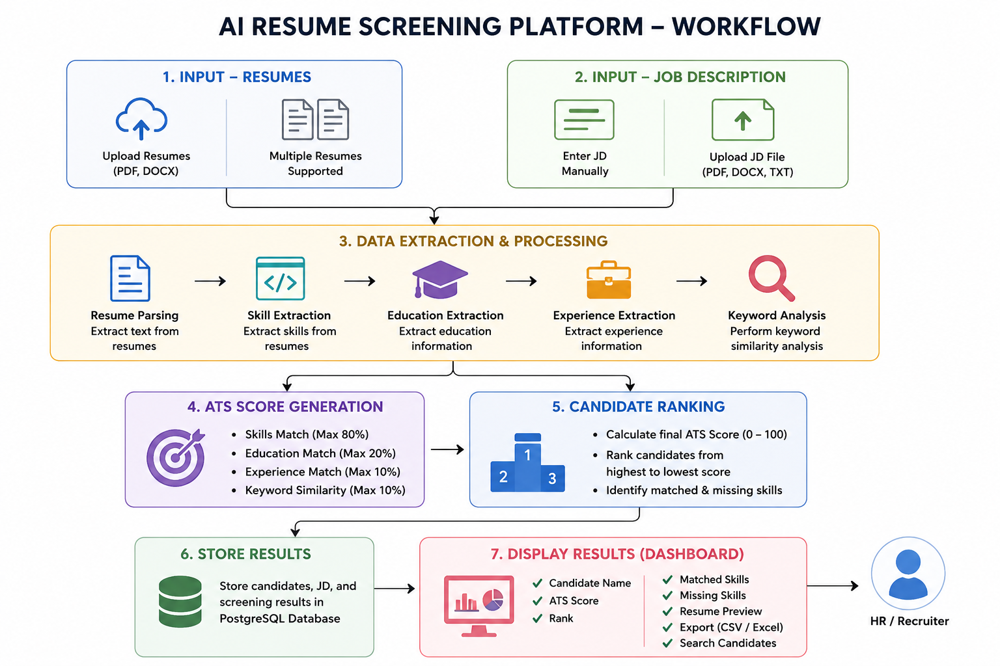
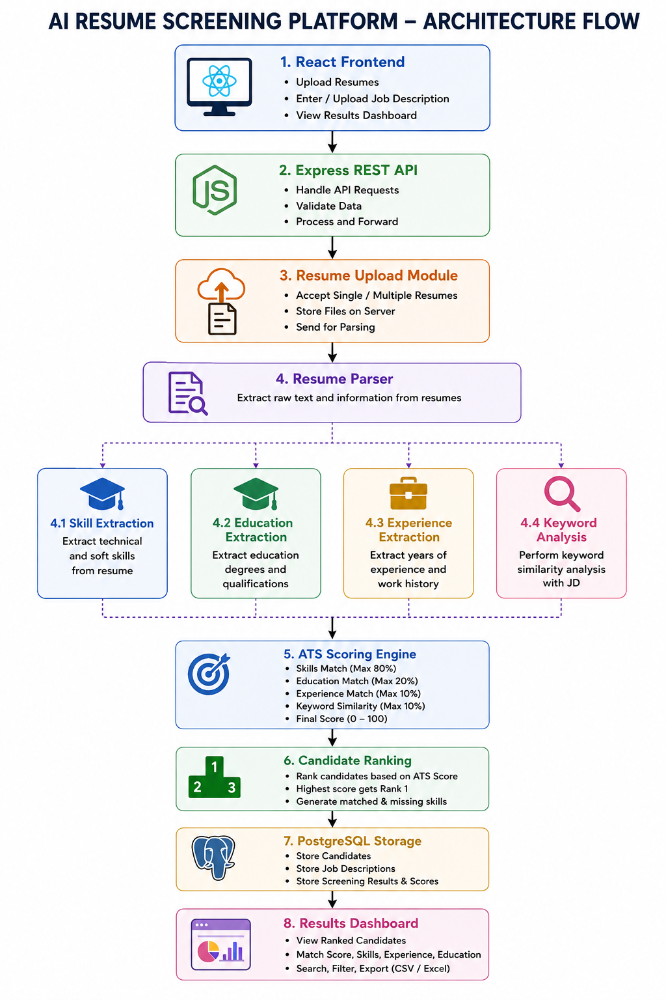
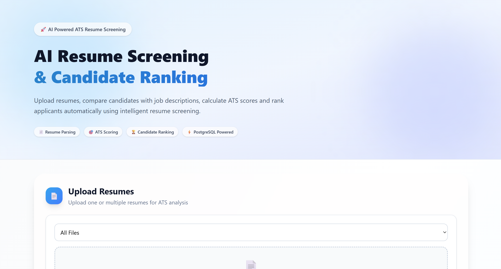
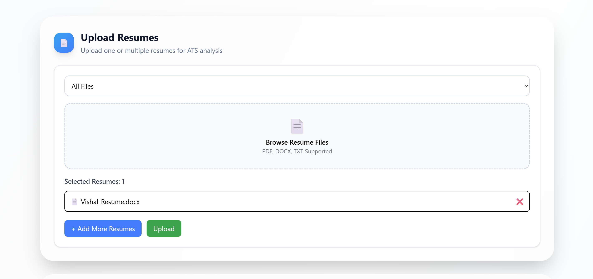
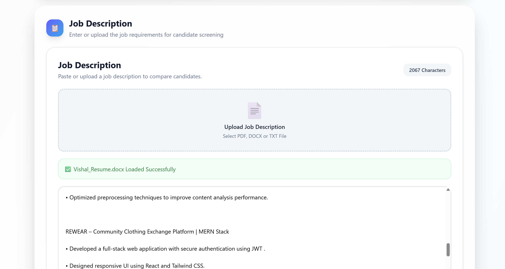
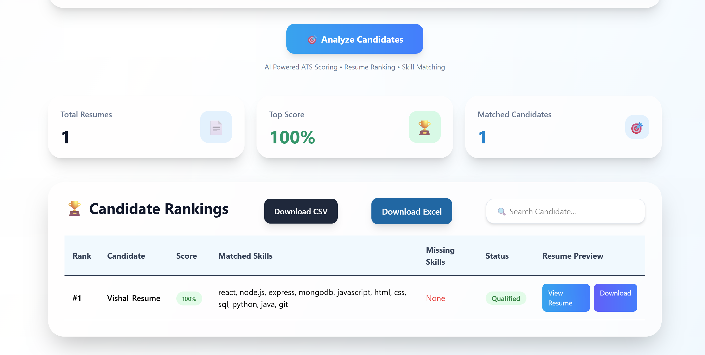

# AI Resume Screening Platform

## Overview

AI Resume Screening Platform is a full-stack web application that automates the initial resume screening process by comparing candidate resumes against a Job Description (JD), generating ATS-style match scores, and ranking candidates based on their suitability for the role.

The platform helps recruiters and hiring teams quickly identify the most relevant candidates, reduce manual screening effort, and streamline the hiring process.

---

## Live Demo

### Frontend

https://ai-resume-screening-platform-ochre.vercel.app/

### Backend API

https://ai-resume-screening-backend-g2eh.onrender.com

---

## GitHub Repository

https://github.com/Vishal7202/ai-resume-screening-platform

---

# Features Implemented

## Resume Management

* Upload Single Resume
* Upload Multiple Resumes
* PDF Resume Support
* DOCX Resume Support
* Resume Preview
* Resume Download
* Resume Fingerprinting
* Resume Storage

---

## Job Description Management

* Enter Job Description Manually
* Upload Job Description File
* PDF JD Support
* DOCX JD Support
* TXT JD Support
* Job Description Storage

---

## Candidate Screening & ATS Scoring

The platform automatically:

* Extracts Skills from Resume
* Extracts Skills from Job Description
* Extracts Education Information
* Extracts Experience Information
* Performs Keyword Similarity Analysis
* Calculates ATS Match Score
* Identifies Matched Skills
* Identifies Missing Skills
* Ranks Candidates Automatically

### Factors Considered

* Skills Match
* Education Alignment
* Experience Relevance
* Keyword Similarity

---

## Results Dashboard

Displays:

* Candidate Name
* Resume Preview
* ATS Match Score
* Candidate Rank
* Matched Skills
* Missing Skills
* Qualification Status

Additional Features:

* Search Candidates
* CSV Export
* Excel Export
* Responsive Dashboard
* ATS Statistics Cards

---

# Tech Stack

## Frontend

* React.js
* Vite
* Tailwind CSS
* Axios

## Backend

* Node.js
* Express.js
* Multer

## Database

* PostgreSQL

## File Processing

* pdf-parse
* mammoth

## Deployment

* Vercel
* Render
* Render PostgreSQL

---

# Database

PostgreSQL is used for storing:

* Uploaded Candidates
* Job Descriptions
* Screening Results

### Tables

#### candidates

Stores uploaded candidate information.

#### job_descriptions

Stores Job Description records.

#### screening_results

Stores ATS scores, ranking results, matched skills, and missing skills.

---

# Project Workflow

### Workflow Diagram



```text
Upload Resumes
        ↓
Upload / Enter Job Description
        ↓
Resume Parsing
        ↓
Skill Extraction
        ↓
Education Extraction
        ↓
Experience Extraction
        ↓
Keyword Analysis
        ↓
ATS Score Generation
        ↓
Candidate Ranking
        ↓
Store Results in PostgreSQL
        ↓
Display Dashboard Results
```

---

# Scoring Approach

The ATS score is generated using multiple evaluation factors.

### Skills Matching

Based on matching skills between the Resume and Job Description.

### Education Matching

Checks whether the candidate's educational qualification aligns with the Job Description requirements.

### Experience Matching

Evaluates whether the candidate's experience satisfies the required experience level.

### Keyword Similarity

Compares important keywords from the Resume and Job Description.

### Final Output

* ATS Score (0–100)
* Candidate Rank
* Matched Skills
* Missing Skills
* Qualification Status

---

# Architecture

### Architecture Diagram



```text
React Frontend
        │
        ▼
Express REST API
        │
        ▼
Resume Upload Module
        │
        ▼
Resume Parser
        │
        ├── Skill Extraction
        ├── Education Extraction
        ├── Experience Extraction
        └── Keyword Analysis
                │
                ▼
          ATS Scoring Engine
                │
                ▼
         Candidate Ranking
                │
                ▼
        PostgreSQL Storage
                │
                ▼
         Results Dashboard
```

---

# Application Screenshots

### Home Page



### Resume Upload



### Job Description Analysis



### Candidate Ranking Dashboard



---

# API Endpoints

### Upload Resume

```http
POST /upload
```

### Upload Job Description

```http
POST /upload-jd
```

### Save Job Description

```http
POST /jd
```

### Extract Skills

```http
POST /extract-skills
```

### Generate Match Score

```http
POST /match-score
```

### Rank Candidates

```http
POST /rank-candidates
```

### Database Test

```http
GET /db-test
```

---

# Setup Instructions

## Clone Repository

```bash
git clone https://github.com/Vishal7202/ai-resume-screening-platform.git
```

---

## Backend Setup

```bash
cd backend
npm install
npm start
```

Backend runs on:

```text
http://localhost:5000
```

---

## Frontend Setup

```bash
cd frontend
npm install
npm run dev
```

Frontend runs on:

```text
http://localhost:5173
```

---

# Environment Variables

Create a `.env` file inside the backend folder.

```env
DATABASE_URL=your_postgresql_connection_string
```

---

# Assumptions

* ATS scoring is based on skill matching, education matching, experience matching, and keyword similarity.
* Higher ATS score indicates better suitability for the role.
* Candidate ranking is determined by the final ATS score.
* Resumes are evaluated against a single Job Description at a time.

---

# Project Status

## Completed

* Resume Upload
* Multiple Resume Upload
* PDF Resume Support
* DOCX Resume Support
* Job Description Upload
* ATS Scoring
* Education Matching
* Experience Matching
* Keyword Similarity Analysis
* Candidate Ranking
* Resume Preview
* Search Functionality
* CSV Export
* Excel Export
* PostgreSQL Integration
* Responsive Dashboard
* Public Deployment

---

# Future Enhancements

* AI/LLM Based Semantic Matching
* Authentication & Authorization
* Recruiter Dashboard Analytics
* Interview Recommendation Engine
* Candidate Feedback Reports
* Advanced Resume Insights

---

# Author

## Vishal Kumar

Full Stack Developer

GitHub:

https://github.com/Vishal7202

---

# Project Outcome

This project successfully demonstrates an end-to-end AI-powered resume screening workflow that automates candidate evaluation, ATS score generation, ranking, resume analysis, and result management using a modern full-stack architecture.
